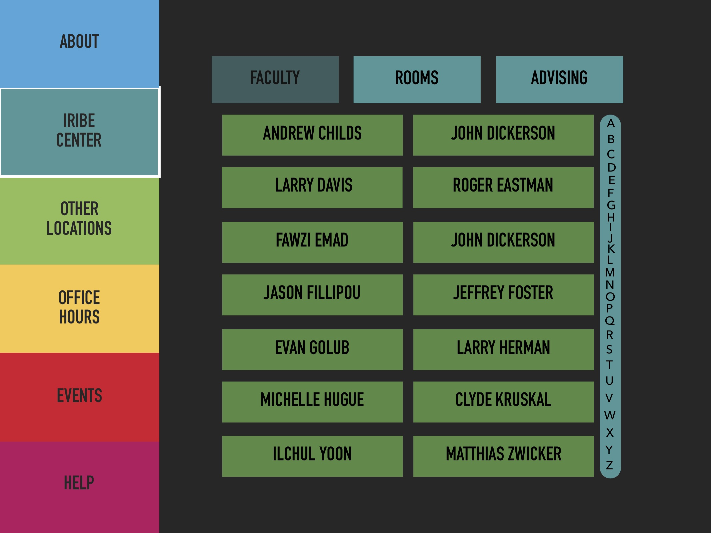
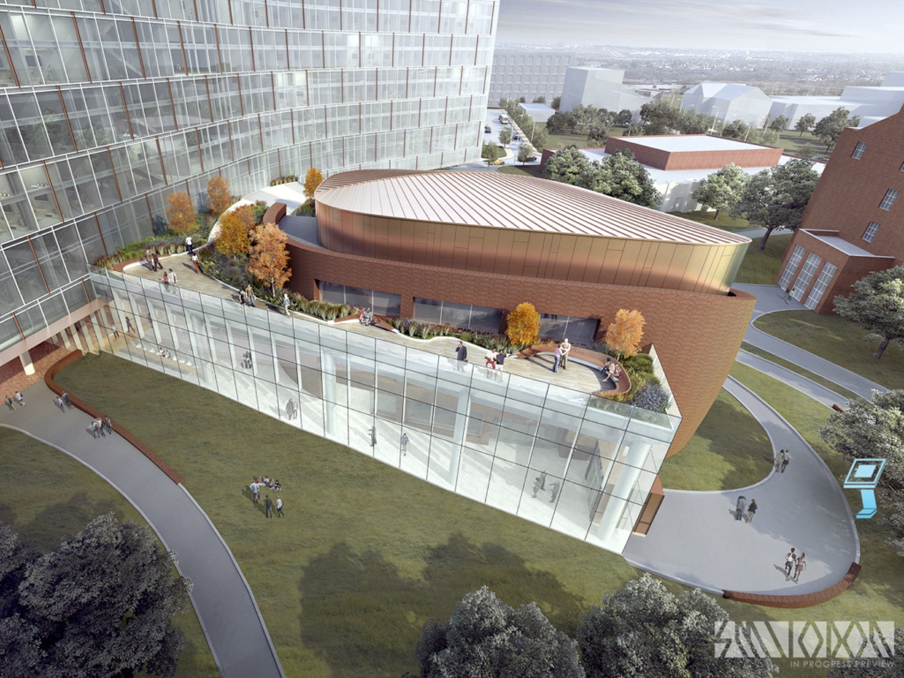
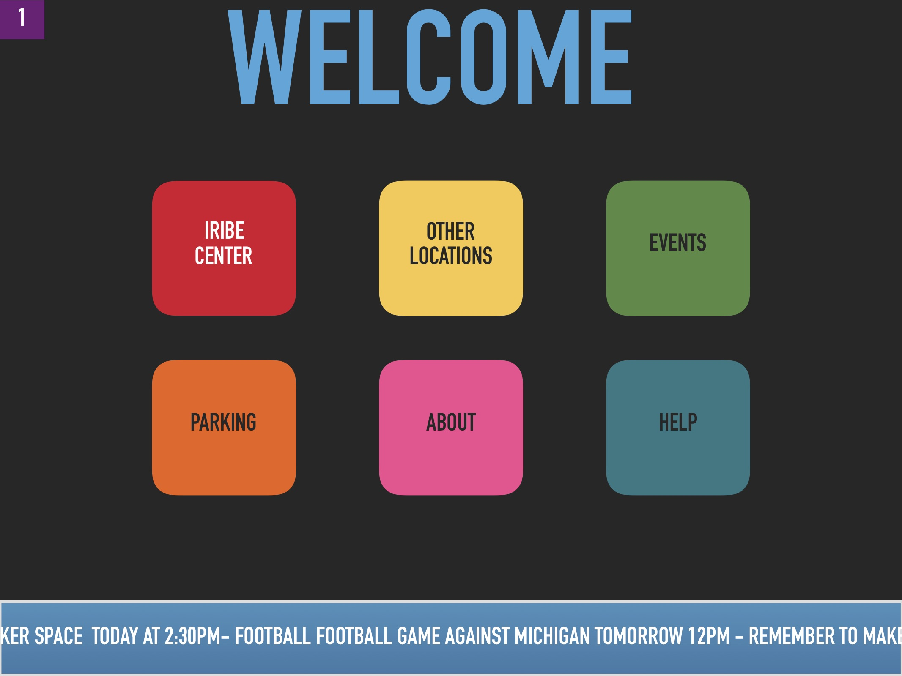
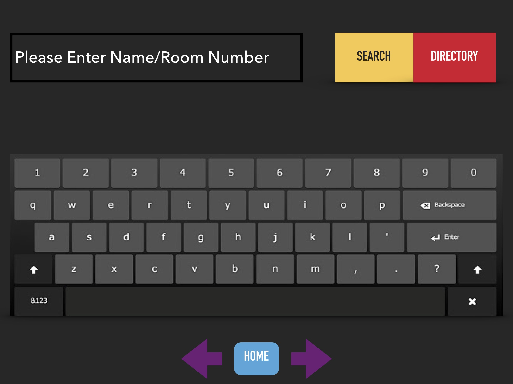
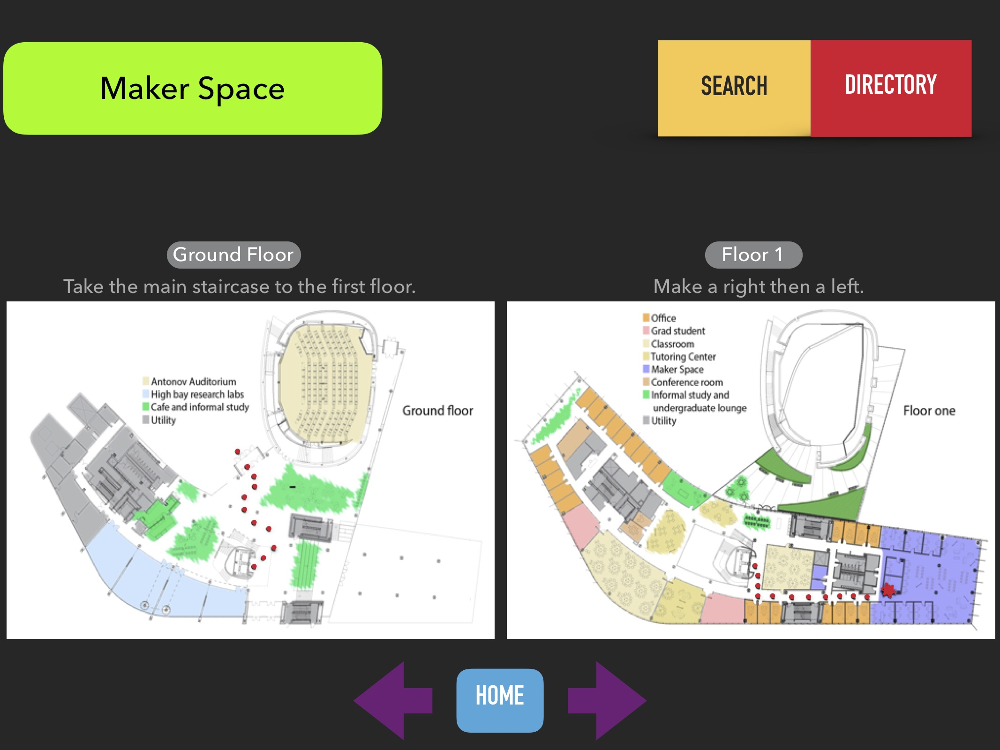

# Iribe Center Kiosk Prototype
## Developers: Dovid Baum, Harshil Sanjay Jain, Samarth Lakhotia, and Amnah Mahmood
### Description: 
> “I want the Iribe Center to feel like Silicon Valley just hit College Park”
> \- Brendan Iribe 

We want to capture the vision of Brendan Iribe by designing an intuitive interactive kiosk to assist all who enter the building in navigation and in capturing the innovative nature the Center portrays of our campus.
 

#### todo: 
• Fix/add rest of low fidelity prototype to Readme 
• 

