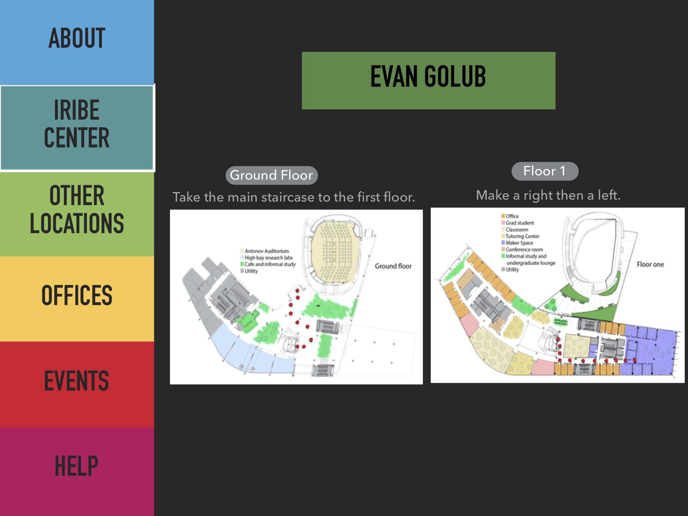

# Iribe Center Kiosk Prototype
## Developers: Dovid Baum, Harshil Sanjay Jain, Samarth Lakhotia, and Amnah Mahmood
### Description: 
> “I want the Iribe Center to feel like Silicon Valley just hit College Park”
> \- Brendan Iribe 

We want to capture the vision of Brendan Iribe by designing an intuitive interactive kiosk to assist all who enter the building in navigation and in capturing the innovative nature the Center portrays of our campus.
 

The medium fidelity prototype consists of multiple .html files along with images 
and external stylesheets.
For the best user experience,  a 14-17 in screen should be optimal.
It can be run on a Windows 7 or above PC.
1) Open the .zip folder with your localhost for the best experience.
2) If the above fails, extract the .zip folder and open the index.html folder.
   Press "F11" on our device to go full screen.
3) If number 2 fails, a back-up has been uploaded here: https://terpconnect.umd.edu/~dbaum/Iribe_Center_Kiosk_Prototype/

#### todo: 
• Fix/add rest of low fidelity prototype to Readme 
• 

